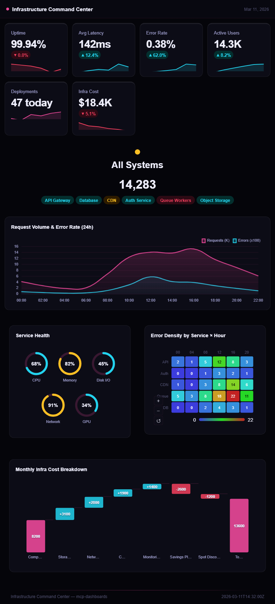
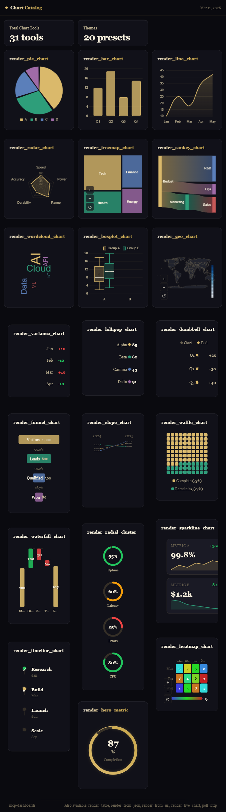
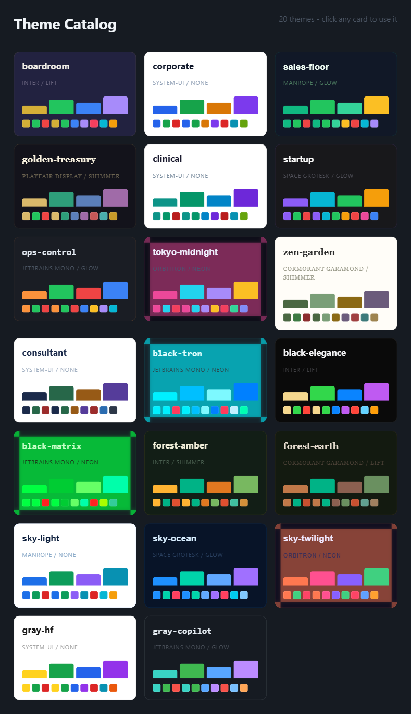

# MCP Dashboards

<!-- mcp-name: io.github.KyuRish/mcp-dashboards -->

### Your AI can talk about data. Now it can show it.

[](https://www.npmjs.com/package/mcp-dashboards)
[](https://glama.ai/mcp/servers/@KyuRish/mcp-dashboards)
[](https://glama.ai/mcp/servers/@KyuRish/mcp-dashboards)
[](LICENSE)
[](https://buymeacoffee.com/kyuish)
[](https://github.com/sponsors/KyuRish)

<p align="center">
  
  <br>
  <a href="assets/dashboard-example.png"></a>&nbsp;
  <a href="assets/chart-catalog.png"></a>&nbsp;
  <a href="assets/theme-catalog.png"></a>
  <br><sub>Click any thumbnail to see full size</sub>
</p>

## The problem

We use AI for everything - analysis, reports, strategy. But when it comes to actually *seeing* the story in your data, you're stuck copying numbers into a spreadsheet and building charts yourself. The conversation has the insight. The visualization is somewhere else.

## The solution

MCP Dashboards renders interactive charts, dashboards, and KPI widgets directly inside your AI conversation. 31 chart tools covering 44+ chart subtypes (bar has stacked/drilldown, hero has 11 variants, etc.), 21 themes, 4 visual discovery catalogs, live polling, PNG/PPT/A4 export - all from a single MCP server. No browser tabs, no copy-paste, no context switching.

## Quick Start

### Claude Desktop

Add to your `claude_desktop_config.json`:

- **Windows:** `%APPDATA%\Claude\claude_desktop_config.json`
- **macOS:** `~/Library/Application Support/Claude/claude_desktop_config.json`

```json
{
  "mcpServers": {
    "dashboard": {
      "command": "npx",
      "args": ["-y", "mcp-dashboards", "--stdio"]
    }
  }
}
```

### Claude Code / VS Code

```bash
claude mcp add dashboard -- npx -y mcp-dashboards --stdio
```

### Remote (Streamable HTTP)

```bash
npx mcp-dashboards
# Server starts on http://127.0.0.1:3001/mcp
```

Bound to localhost by default. See [Configuration](#configuration) if you need to expose it on your network or allow browser access from a non-localhost origin.

### Supported clients

Works in any MCP Apps-compatible client: **Claude Desktop**, **Claude Web**, **VS Code** (GitHub Copilot), **Goose**, **Postman**, **MCPJam**. ChatGPT support is rolling out.

## Just ask

No API to learn. Describe what you want in plain English:

- *"Compare Q1 vs Q2 revenue by region as a bar chart"*
- *"Show my portfolio allocation as a donut chart with the boardroom theme"*
- *"Build a dashboard with monthly sales KPIs and a trend line"*
- *"Visualize website traffic by country on a world map"*
- *"Track Bitcoin price live, updating every 30 seconds"*
- *"Show the conversion funnel from signup to purchase"*
- *"Rank the team by performance using a radar chart"*

The AI picks the right tool, formats your data, and renders the chart inline. Click any data point to ask follow-up questions.

**Don't know where to start?** Ask *"show me the catalog"* — opens a master dashboard with one live visual tile per customization dimension (a real bar chart for charts, a pie for themes, a progress ring for hero variants, a neon-glowing card for effects). Click any tile, hit Ask, and you'll drill into that sub-catalog.

## Interactive charts, not images

Every chart is **interactive HTML** rendered directly in your conversation:

- **Explore in-chat** - hover tooltips, click-to-select (feeds back to the AI), drill-down with breadcrumbs, scroll-zoom up to 12x on maps and heatmaps
- **Live polling** - real-time charts that auto-update from any API on a timer
- **Export anywhere** - PPT (16:9 slides), A4 (paginated with smart page breaks), PNG, CSV

<details>
<summary><strong>All Tools</strong></summary>

| Tool | Type | Best For |
|------|------|----------|
| `render_pie_chart` | Pie/Donut | Composition - "what makes up the whole?" |
| `render_bar_chart` | Bar | Comparison - vertical, horizontal, stacked, drill-down |
| `render_line_chart` | Line/Area | Trends - smooth curves, gradient fills, time series |
| `render_scatter_chart` | Scatter | Relationships - per-point labels, annotations, quadrants |
| `render_candlestick_chart` | Candlestick | Finance - OHLC data with volume bars |
| `render_radar_chart` | Radar | Multi-axis comparison - skills, scores, product attributes |
| `render_treemap_chart` | Treemap | Hierarchy - nested rectangles sized by value |
| `render_sankey_chart` | Sankey | Flow - money, users, or resources between stages |
| `render_wordcloud_chart` | Word Cloud | Frequency - sized words from text analysis |
| `render_boxplot_chart` | Boxplot/Violin | Distribution - quartiles, outliers, density shapes |
| `render_live_chart` | Live | Real-time - auto-polls any MCP tool on a timer |
| `poll_http` | Data proxy | Fetch JSON from any HTTP endpoint - secure presets or public URLs |
| `render_bullet_chart` | Bullet | KPI vs target - 2-8 zone bands with labels |
| `render_lollipop_chart` | Lollipop | Ranking - clean dots with optional target markers |
| `render_dumbbell_chart` | Dumbbell | Gaps - before/after with scale labels and zone bands |
| `render_variance_chart` | Variance | Budget - actual vs budget, color-coded over/under |
| `render_funnel_chart` | Funnel | Conversion - staged drop-off with percentages |
| `render_slope_chart` | Slope | Change - ranking shifts between two periods |
| `render_waffle_chart` | Waffle | Proportion - 10x10 grid showing composition |
| `render_sparkline_chart` | Sparkline | Compact trends - mini cards with change indicators |
| `render_radial_cluster` | Radial | Health check - multi-metric ring gauges with status |
| `render_waterfall_chart` | Waterfall | Cumulative - cascading bars showing impact |
| `render_heatmap_chart` | Heatmap | Intensity - 2D grid with color mapping |
| `render_geo_chart` | Geo/Map | Geography - color-coded countries by value (choropleth) |
| `render_bubble_map` | Bubble Map | Pin map - sized circles at lat/lng coordinates |
| `render_timeline_chart` | Timeline | Progress - milestone tracker with status indicators |
| `render_hero_metric` | Hero | KPI widgets - 11 variants (progress ring, gem, orb, NPS, etc.) |
| `render_dashboard` | Dashboard | Everything - KPI cards + multiple charts in responsive grid |
| `render_table` | Table | Data - sortable columns, striped rows, CSV export |
| `render_from_json` | Auto-detect | Any JSON data - picks the best chart automatically |
| `render_from_url` | URL fetch | Fetches JSON from a URL and auto-visualizes |

**Discovery / Catalogs** — visual entry points for browsing what's available:

| Tool | Shows | When to use |
|------|-------|-------------|
| `render_catalog` | Master catalog with 4 live preview tiles | Don't know where to start. Click any tile, hit Ask, drill in. |
| `render_chart_catalog` | All 31 chart types with mini previews | Looking for the right chart for your data |
| `render_theme_catalog` | All 21 themes with color/typography/effects | Picking a theme |
| `render_hero_catalog` | All 11 hero metric variants | Picking a KPI widget style |
| `render_effects_catalog` | All 5 effect presets, each applied to a real card | Picking an animation/glow style |

Typography is still configurable on every chart via `typography=<name>` (8 options listed under [Themes](#themes)) — it just doesn't have its own catalog because all 8 options were visually identical without per-card font loading, which wasn't worth the build for one preview tool.

</details>

<details>
<summary><strong>Which chart should I use?</strong></summary>

| Question | Best Chart | Also Works |
|----------|-----------|------------|
| "What makes up the whole?" | Pie/Waffle | Treemap, Stacked bar |
| "How do values compare?" | Bar | Lollipop, Bullet, Radar |
| "What's the trend over time?" | Line | Sparkline, Slope |
| "Are we hitting targets?" | Bullet | Variance, Radial |
| "Where's the gap?" | Dumbbell | Variance |
| "How does X relate to Y?" | Scatter | Heatmap |
| "What's the conversion rate?" | Funnel | Waterfall, Sankey |
| "What changed between periods?" | Slope | Dumbbell |
| "What's the financial picture?" | Candlestick | Line |
| "Show me the KPI" | Hero metric | Dashboard |
| "What's the distribution?" | Boxplot | Violin (same tool) |
| "Where does money/traffic flow?" | Sankey | Treemap |
| "How do options score across axes?" | Radar | Heatmap |
| "What are the top keywords?" | Word Cloud | Bar, Treemap |
| "Where are users/sales/revenue?" | Geo map | Bubble map, Heatmap |
| "Monitor this in real-time" | Live chart | - |

</details>

## Themes

21 built-in themes. Pass `theme` to any tool.

| Family | Themes |
|--------|--------|
| **Classic** | `boardroom`, `corporate`, `sales-floor`, `golden-treasury`, `clinical`, `startup`, `ops-control`, `tokyo-midnight`, `zen-garden`, `consultant` |
| **Black/AI** | `black-tron` (cyan neon), `black-elegance` (warm gold), `black-matrix` (green hacker) |
| **Forest** | `forest-amber` (autumn), `forest-earth` (terracotta) |
| **Sky** | `sky-light` (airy blue), `sky-ocean` (deep navy), `sky-twilight` (sunset) |
| **Office** | `office-red` (corporate red, white bg - report-ready) |
| **Gray/ML** | `gray-hf` (warm yellow accent), `gray-copilot` (teal on dark) |

Mix-and-match with `palette`, `typography` (8 options: system, mono, professional, editorial, bold, techno, cyberpunk, luxury), and `effects` (5 presets: none, subtle, shimmer, neon, energetic).

## Live Polling

Real-time charts that auto-update from any API. The live chart polls data via `poll_http`, which supports two modes:

### Secure presets (authenticated APIs)

Configure presets via env vars. Credentials stay server-side and never appear in the conversation.

```json
{
  "mcpServers": {
    "dashboard": {
      "command": "npx",
      "args": ["-y", "mcp-dashboards", "--stdio"],
      "env": {
        "POLL_PRESET_T212_CASH_URL": "https://live.trading212.com/api/v0/equity/account/cash",
        "POLL_PRESET_T212_CASH_HEADERS": "{\"Authorization\": \"Bearer YOUR_API_KEY\"}"
      }
    }
  }
}
```

Then ask: *"Monitor my portfolio total and P/L live"* - the AI uses `render_live_chart` with `pollArgs: { preset: "t212_cash" }`.

**Naming:** `POLL_PRESET_<NAME>_URL` and `POLL_PRESET_<NAME>_HEADERS` (JSON object).

### Public URLs (no auth needed)

For public APIs, use the URL directly:

*"Show me Bitcoin price updating every 30 seconds"* - uses `pollArgs: { url: "https://api.coingecko.com/api/v3/simple/price?ids=bitcoin&vs_currencies=usd" }`.

## How It Works

Built on [MCP Apps](https://modelcontextprotocol.io/docs/extensions/apps). You ask the AI to visualize data, it calls the right tool, and the chart renders inline in your conversation. Self-contained - zero CDN, zero external requests.

**MCP Apps supported** (inline rendering): Claude Desktop, VS Code Insiders + MCP Apps extension, Goose, Postman.

**No MCP Apps support?** No problem. Every chart response also includes a clickable link to the same interactive chart in your browser:
- `http://localhost:PORT/chart/{id}` - the clickable link in chat. Backed by a tiny same-machine HTTP server bound to 127.0.0.1, lazy-started on the first preview request.
- `file:///.../chart-{id}.html` - the persistent shareable artifact. Same HTML bytes, written to disk so you can email, archive, or open it after the server has shut down.

Why both: Claude Code (VS Code) strips `file://`, `vscode://`, and `command://` URL schemes from chat markdown, so only `http://` produces a working clickable link. The file:// path is provided for sharing and offline viewing. Tool annotations (`readOnlyHint`, `idempotentHint`, `openWorldHint`) help clients reason about tool behavior.

## Configuration

All optional. Defaults are safe — set these only if you need to override.

| Env var | Default | What it does |
|---------|---------|--------------|
| `MCP_DASHBOARDS_RETAIN_DAYS` | `7` | How long to keep chart preview HTML files on disk. `0` disables auto-cleanup. |
| `MCP_DASHBOARDS_DISABLE_PREVIEW` | unset | Kill switch — no HTML files written, no preview server started, no preview links. Inline rendering still works in MCP Apps clients. |
| `MCP_HTTP_BIND_HOST` | `127.0.0.1` | HTTP-transport bind host. Stays on localhost by default. Set to `0.0.0.0` only if you trust your network. |
| `MCP_CORS_ALLOWED_ORIGINS` | localhost only | Comma-separated origins allowed to call the HTTP endpoint from a browser. Set this to add a non-localhost origin (e.g. `https://your-app.com`). |
| `MCP_URL_ALLOWLIST` | empty | Comma-separated hostnames that bypass the SSRF guard for `render_from_url` / `poll_http`. Use only for internal endpoints you fully trust. |
| `MCP_OUTBOUND_RATE_PER_SEC` | `10` | Per-host throttle for outbound HTTP calls. |
| `MCP_OUTBOUND_BURST` | `20` | How many initial requests can fire immediately before the rate kicks in. |
| `POLL_PRESET_<NAME>_URL` | — | Server-side preset URL for live polling. See [Live Polling](#live-polling). |
| `POLL_PRESET_<NAME>_HEADERS` | — | Auth headers (JSON object) for the matching preset URL. |

### What's on disk

Chart HTML files are written to `<system temp>/mcp-dashboards/` and auto-deleted after 7 days. The chart's built-in download button (PNG / PPT / A4) is the recommended way to save anything permanently.

Ask your AI to *"list chart files"* or *"delete chart files older than 1 day"* anytime — invokes `list_chart_files` / `delete_chart_files`.

**Requirements:** Node.js 18+.

<details>
<summary><strong>Contributing</strong></summary>

```bash
git clone https://github.com/KyuRish/mcp-dashboards.git
cd mcp-dashboards
npm install
npm run build
npm run serve   # http://localhost:3001
npm run dev     # watch mode
```

</details>

## Support

If MCP Dashboards is useful to you:

[](https://buymeacoffee.com/kyuish)
[](https://github.com/sponsors/KyuRish)

## Privacy

All processing happens locally. No data is collected, transmitted, or stored externally.

External calls only happen when *you* explicitly ask — `render_from_url` and `poll_http` need a URL or preset you provide. Both refuse to fetch private, loopback, or link-local addresses (your `192.168.*` network, AWS metadata at `169.254.169.254`, etc.) so a prompt-injected AI can't quietly reach internal services. They also throttle per hostname so a runaway loop won't get your IP banned from a real API.

Credentials in env var presets never leave your machine. The browser preview server and the optional HTTP transport both bind to `127.0.0.1` by default and are not reachable from other devices. Chart HTML files live in your system temp folder and auto-delete after 7 days. See [Configuration](#configuration) to change any of this.

## License

[FSL-1.1-MIT](LICENSE) - Free to use for any purpose except building a competing commercial product. Each version converts to MIT two years after release. For commercial licensing, contact [contact@kyuish.com](mailto:contact@kyuish.com).
